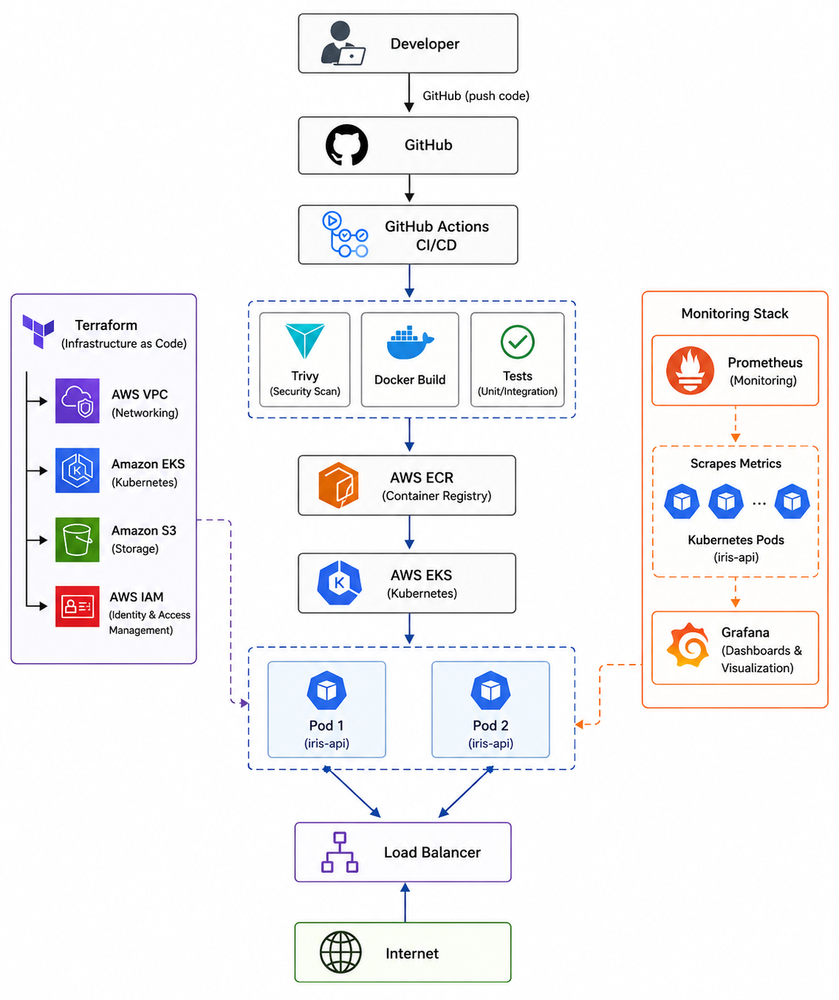

# 🚀 Secure MLOps Platform on AWS


A production-grade MLOps platform built on AWS EKS with automated CI/CD, 
security scanning, and real-time monitoring.

---

## 🏗️ Architecture

#
## 🏗️ Architecture


---

## ✨ Features

- **ML API** — FastAPI-based REST API serving Iris flower predictions
- **Containerized** — Docker with multi-stage security hardening
- **Kubernetes** — Deployed on AWS EKS with RBAC and resource limits
- **CI/CD** — Fully automated GitHub Actions pipeline
- **Security** — Trivy container scanning, non-root user, 94% CVE reduction
- **Monitoring** — Prometheus metrics + Grafana dashboards
- **IaC** — Complete AWS infrastructure as Terraform modules

---

## 🛠️ Tech Stack

| Category | Tools |
|---|---|
| Cloud | AWS (EKS, ECR, S3, IAM, VPC) |
| Containers | Docker, Kubernetes, Helm |
| CI/CD | GitHub Actions |
| IaC | Terraform (modular) |
| Security | Trivy, RBAC, Non-root containers |
| Monitoring | Prometheus, Grafana |
| API | Python, FastAPI, Uvicorn |
| ML | Scikit-learn, Random Forest |

---

## 📁 Project Structure

'''
mlops-platform/
├── app/                    # FastAPI ML application
│   ├── main.py             # API endpoints + Prometheus metrics
│   ├── model.py            # ML model training
│   └── requirements.txt    # Python dependencies
├── kubernetes/             # Kubernetes manifests
│   ├── deployment.yaml     # App deployment
│   ├── service.yaml        # LoadBalancer service
│   └── rbac.yaml           # RBAC permissions
├── terraform/              # AWS Infrastructure as Code
│   ├── main.tf             # Root module
│   ├── variables.tf        # Input variables
│   └── modules/
│       ├── vpc/            # VPC, subnets, routing
│       ├── eks/            # EKS cluster + node groups
│       ├── iam/            # IAM roles + policies
│       └── s3/             # Model storage bucket
├── monitoring/             # Observability stack
│   ├── prometheus.yaml     # Prometheus deployment
│   └── grafana.yaml        # Grafana deployment
├── .github/workflows/      # CI/CD pipeline
│   └── ci-cd.yaml          # GitHub Actions workflow
└── Dockerfile              # Hardened container image
'''

---

## 🚀 Quick Start

### Prerequisites
- AWS CLI configured
- kubectl installed
- Terraform >= 1.7
- Docker installed

### 1. Clone the repository
```bash
git clone https://github.com/paramshivam0018/mlops-platform.git
cd mlops-platform
```

### 2. Provision AWS Infrastructure
```bash
cd terraform
terraform init
terraform apply
```

### 3. Configure kubectl
```bash
aws eks update-kubeconfig --region ap-south-1 --name mlops-cluster
```

### 4. Deploy to EKS
```bash
kubectl apply -f kubernetes/rbac.yaml
kubectl apply -f kubernetes/deployment.yaml
kubectl apply -f kubernetes/service.yaml
```

### 5. Deploy Monitoring
```bash
kubectl apply -f monitoring/prometheus.yaml
kubectl apply -f monitoring/grafana.yaml
```

### 6. Test the API
```bash
# Health check
curl http://<EXTERNAL-IP>/health

# Predict
curl -X POST http://<EXTERNAL-IP>/predict \
  -H "Content-Type: application/json" \
  -d '{"features": [5.1, 3.5, 1.4, 0.2]}'
```

---

## 🔐 Security

- ✅ Non-root container user
- ✅ Trivy vulnerability scanning in CI/CD
- ✅ 94% CVE reduction after hardening
- ✅ Kubernetes RBAC with least privilege
- ✅ AWS IAM roles with minimal permissions
- ✅ Private ECR repository
- ✅ S3 bucket with public access blocked

---

## 📊 Monitoring

- Prometheus scrapes `/metrics` endpoint every 15 seconds
- Grafana dashboards for request rate, latency, pod health
- Alerting rules for pod crashes and high error rates

---

## 🔄 CI/CD Pipeline

Every push to `main` triggers:
Code Push → Tests → Trivy Scan → Docker Build → Push to ECR → Deploy to EKS

---

## 💰 Cost Optimization

- EKS spun up only when needed using Terraform
- t3.micro worker nodes for cost efficiency  
- `terraform destroy` after each session keeps costs under ₹20/session

---

## 👨‍💻 Author

**Param Shivam**  
DevOps Engineer | 5+ Years | Ericsson  
📧 paramshivam.in@gmail.com
